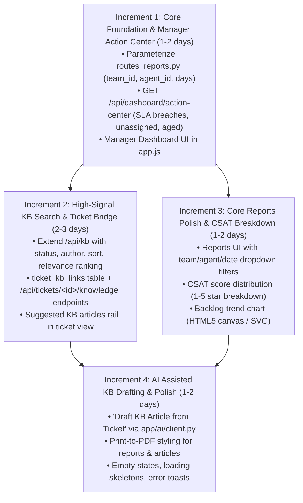

# OpsDesk — Unified Plans Debate & Master Plan

**Context:** Internal-only Flask + SQLite + Vanilla JS Helpdesk  
**Current State:**
- Dashboard: Role-aware Increment 1 implemented (Agent "My Dashboard" vs Manager Dashboard).
- Reports: 4 static endpoints (`summary`, `workload`, `sla`, `trend`) + CSV export; no query parameter filtering.
- Knowledge Base: Flat articles with basic `LIKE` search, category assignment, view counter, and feedback votes.
- AI: Hardened OpenRouter client (`app/ai/client.py`) available for ticket reply suggestions and summaries.

---

## 1. Critique of the Three Proposed Plans

### Plan 1: Role-Aware Dashboard (Increments 1–3)
- **Strengths:** Increment 1 is already implemented and delivering immediate value to agents (the largest user cohort). Role separation between agent personal metrics and manager team metrics aligns with real workflows.
- **Weaknesses & Gaps:**
  - **Hidden dependency on Reports:** Increment 2 (Manager Action Center / Team metrics) cannot be cleanly built without parameterizing the reporting queries. Without `?team_id=` and `?agent_id=` filters, the dashboard must either duplicate SQL aggregations or display rigid global data.
  - **Fragile "Pending Reply" heuristic:** The data model lacks a `needs_reply` / `awaiting_response` flag. Calculating this on the fly by scanning ticket activity / comments requires careful indexing or lightweight heuristic definitions (e.g., open tickets with no agent comment in >4 hours).
  - **Scope creep in Increment 3:** Adding a multi-dimensional global filter bar across heterogeneous widgets in vanilla JS creates significant state synchronization, URL persistence, and back-button complexity for little internal benefit.

### Plan 2: Knowledge Center (Increments K1–K6)
- **Strengths:** Recognizes the high value of connecting documentation directly to ticket resolution (K3) and improving search discovery (K1).
- **Weaknesses & Gaps:**
  - **Wrong sequencing:** K2 (Wikilinks `[[Title]]` parsing & backlinks) and K4 (Collections) are sequenced before K3 (Ticket ↔ KB Integration). Agents need to attach solutions to tickets and search quickly; they do not need an Obsidian-style personal knowledge graph or complex collection nesting in v1.
  - **Schema explosion in SQLite:** Proposing 5 new tables (`kb_article_links`, `ticket_kb_links`, `kb_collections`, `kb_collection_articles`, `kb_article_versions`) creates heavy SQLite migration overhead. SQLite has limited `ALTER TABLE` support and lacks foreign-key alter ergonomics.
  - **Redundant analytics:** K5 (Knowledge Health Dashboard) builds a standalone analytics subsystem instead of leveraging the existing `routes_reports.py` architecture.
  - **Over-bundled K6:** Version diffing and AI drafting are separate concerns; AI draft generation is already 80% enabled via `app/ai/client.py` and should not be held back by version history schema design.

### Plan 3: Reports Overhaul (Increments R1–R4)
- **Strengths:** Correctly identifies that report endpoints need filter parameters (`team_id`, `agent_id`, date ranges) and percentile/distribution metrics (R1/R2).
- **Weaknesses & Gaps:**
  - **Severe enterprise over-engineering in R3/R4:** "Custom Report Builder skeleton", "Saved Reports", "Channels Report", and "Customers Report" violate the project constraints. OpsDesk is an internal-only staff request system (no external multi-channel intake, no commercial customer accounts). Building a generic report builder in vanilla JS / SQLite is a massive distraction from core triage and ticketing.
  - **R4 knowledge integration is misplaced:** Reporting on KB should be a single simple endpoint or added to summary stats, not a complex cross-subsystem initiative with dedicated PDF export engines. Browser print-to-PDF (`window.print()`) is standard and zero-cost for internal tools.

---

## 2. Ranked Risks (Cross-Plan & Architectural)

| Rank | Risk Area | Description | Mitigation Strategy |
| :--- | :--- | :--- | :--- |
| **R1 (Critical)** | **Cross-Plan Duplication & Divergence** | Dashboard (Plan 1), Reports (Plan 3), and KB Health (Plan 2) each attempt to build separate aggregation and filtering logic. | **Merge R1 into Dashboard Increment 2**: Parameterize `routes_reports.py` once with `team_id`, `agent_id`, `date_from`/`date_to`, and reuse these exact endpoints for dashboard cards and report views. |
| **R2 (High)** | **SQLite Schema & Migration Bloat** | Creating 6+ tables across KB and Reports simultaneously will complicate database lifecycle and test setup. | Keep schema additions minimal and surgical: Only add `ticket_kb_links` for v1. Defer wikilinks, collections, versions, and saved report tables to v2. |
| **R3 (High)** | **"Pending Reply" Heuristic Performance** | Calculating pending response status dynamically without a schema column could trigger N+1 scans across ticket comments. | Define a strict SQL subquery on `ticket_comments` or `activity_log` (or check `assignee_id IS NOT NULL AND status IN ('assigned','in_progress') AND updated_at < datetime('now','-4 hours')`). |
| **R4 (Medium)** | **Vanilla JS Frontend State Complexity** | Attempting interactive report builders, global multi-select filter bars, and graph canvases in vanilla JS will result in brittle UI state bugs. | Keep layouts server-query driven: Filter changes reload the view with URL search params (`?team_id=1&days=30`). Avoid client-side ad-hoc state trees. |
| **R5 (Medium)** | **AI Provider Availability** | Features relying on OpenRouter (`generate_draft_from_ticket`) must fail gracefully if the user has not configured an API key. | Reuse the existing `ai_enabled()` and fail-closed pattern in `app/ai/client.py`. Display disabled/configured status in the UI. |

---

## 3. Answers to the Debate Questions

### Q1: Which plan should we prioritize first, and why?
**Revised Priority:** **Plan 1 (Dashboard) + Plan 3 (Reports Engine) unified first, followed by Plan 2 (Ticket-linked KB).**
- **Why:** The dashboard is the daily landing page for all staff. Because Increment 1 (Agent Dashboard) is already delivered, completing Increment 2 (Manager Action Center) requires adding filters to `routes_reports.py`. Doing this immediately fulfills the core value of both Plan 1 and Plan 3 in a single stroke. Once triage is fast, linking KB articles to tickets (Plan 2) delivers the highest operational multiplier.

### Q2: Are any of these plans too big or wrongly sequenced?
- **Plan 3 is too big:** R3 and R4 contain enterprise fluff (custom report builder, saved reports, customer/channel dimensions) that must be cut.
- **Plan 2 is wrongly sequenced:** K2 (Wikilinks) and K4 (Collections) were placed before K3 (Ticket ↔ KB links). Ticket-KB linking is the primary value driver and must come immediately after search improvements (K1).

### Q3: What is the highest-risk assumption in each plan?
- **Plan 1:** Assuming "Needs Reply / Pending Response" can be easily computed without schema changes or slow queries.
- **Plan 2:** Assuming agents will curate internal wikilinks (`[[Title]]`) and hierarchical collections in an internal IT helpdesk.
- **Plan 3:** Assuming managers need custom SQL/report builders rather than fixed, high-signal operational metrics (SLA, backlog, agent workload).

### Q4: What should we defer to v2?
- **Custom Report Builder & Saved Reports** (Unnecessary state overhead).
- **Channels & Customers Reports** (OpsDesk is internal-only staff-to-staff).
- **Obsidian-style Wikilinks Graph & `[[Title]]` Parser** (Premature; backlinks offer low ROI in standard IT workflows).
- **Article Collections Hierarchy** (Existing categories are sufficient).
- **Article Version Diffs & Snapshot Table** (Flat edits with `updated_at` and `activity_log` are sufficient for v1).
- **Dedicated PDF Generation Library** (Use standard CSS print stylesheets with `window.print()`).
- **Semantic / Vector Search** (SQLite text relevance with title/body weight is fast and zero-dependency).

### Q5: What shortcuts using existing endpoints/code are we missing?
1. **Unified Reporting Filter**: Parameterizing `routes_reports.py` (`/api/reports/summary`, `/api/reports/workload`, `/api/reports/sla`, `/api/reports/trend`) with `?team_id=X&agent_id=Y&days=N` powers both the Reports page and the Manager Dashboard widgets with **zero redundant endpoints**.
2. **AI Drafting Shortcut**: `app/ai/client.py` already implements OpenRouter completions with prompt-injection defenses. "Generate KB Article from Ticket" can be added with ~25 lines of Python using a targeted prompt template.
3. **Activity Logging**: `helpers.log_activity(tid, uid, action, note)` already exists. Linking a KB article to a ticket or updating an article can reuse this helper without new audit tables.
4. **Existing Feedback Table**: `kb_feedback` is already implemented with helpfulness scores; calculating KB quality metrics requires only a SQL aggregate (`SUM(helpful)*100.0/COUNT(*)`), not a new analytics engine.

### Q6: What is the single most valuable 1-2 day increment across all three plans?
**The "Report Filters + Manager Action Center" Increment (Merged Plan 1-Inc 2 & Plan 3-R1):**
- Extend `routes_reports.py` to accept `team_id`, `agent_id`, and `days` filters.
- Add `GET /api/dashboard/action-center` returning unassigned tickets, SLA breaches (`ticket_sla.breached = 1` or nearing breach), and stale open tickets.
- Render the Manager Action Center and team summary on the Dashboard in `static/js/app.js`.
- **Result:** Complete role-based operational dashboard for both agents and managers in 1–2 days.

---

## 4. Master Revised Roadmap (4 Lean Increments)

### Increment 1: Core Reporting Engine & Manager Action Center (1–2 Days)
- **Goal:** Unify reporting backend and complete the Manager Dashboard experience.
- **Backend:**
  - Update `/api/reports/summary`, `/api/reports/workload`, `/api/reports/sla`, and `/api/reports/trend` in `routes_reports.py` to accept optional `team_id`, `assignee_id`, and `days` / `date_from` / `date_to`.
  - Add `GET /api/dashboard/action-center`: Returns unassigned tickets, active/imminent SLA breaches (from `ticket_sla`), and stale open tickets (>24h without update).
- **Frontend:**
  - Update `viewDashboard()` in `static/js/app.js`: Render the Manager Action Center table and Team Workload strip with click-through filters to `/tickets`.
- **Tests:** Parameterized report tests + Action Center endpoint tests + role authorization checks.

### Increment 2: High-Signal KB Search & Ticket ↔ KB Bridge (2–3 Days)
- **Goal:** Transform KB from a static repository into an active ticket resolution tool.
- **Backend:**
  - Schema: Create `ticket_kb_links (id, ticket_id, article_id, linked_by_id, created_at, note)`.
  - Update `GET /api/kb`: Add filters (`category_id`, `status`, `author_id`, `sort=updated_at|views|helpful`) and SQL title/body weighted relevance.
  - Add `GET/POST/DELETE /api/tickets/<id>/knowledge`: Manage linked articles on tickets.
  - Add `GET /api/tickets/<id>/knowledge/suggested`: Keyword overlap search between ticket subject/description and published KB articles.
- **Frontend:**
  - Help Center & KB Manager: Add filter chips and sort dropdown.
  - Ticket Detail View: Add "Linked Knowledge Base Articles" card with quick-search, attach action, and suggested article recommendations.
- **Tests:** KB filter queries, link/unlink lifecycle, and ticket-knowledge permissions.

### Increment 3: Reports UI Overhaul & CSAT Distribution (1–2 Days)
- **Goal:** Complete the Reports view with high-signal operational analytics.
- **Backend:**
  - Add CSAT score breakdown (counts for 1, 2, 3, 4, 5 stars) to `/api/reports/summary`.
  - Calculate P90 and median resolution hours alongside average resolution hours.
- **Frontend:**
  - Reports page in `app.js`: Add Team, Agent, and Date Range filter bar.
  - Render Summary KPIs, SLA attainment meter, Agent Workload table, CSAT star distribution bar, and Trend line/bar (using lightweight SVG/HTML bars).
  - Update CSV export to respect active filter parameters.
- **Tests:** CSAT distribution math, filter parameter validation on CSV export.

### Increment 4: AI-Assisted KB Drafting & Operational Polish (1–2 Days)
- **Goal:** Accelerate knowledge creation and polish cross-system ergonomics.
- **Backend:**
  - Add `POST /api/ai/draft-kb-from-ticket`: Uses `app/ai/client.py` with ticket context (subject, description, comments, resolution) to generate a structured markdown draft (Problem, Root Cause, Solution).
- **Frontend:**
  - "Promote to KB Article" button on resolved tickets: Opens KB editor pre-populated with AI-generated draft.
  - Print styling (`@media print`) for clean browser PDF export of tickets, reports, and KB articles.
- **Tests:** AI prompt generation test with fallback when AI key is missing.

---

## 5. Summary of Deferrals to v2

| Feature | Plan Origin | Reason for Deferral |
| :--- | :--- | :--- |
| **Custom Report Builder / SQL Builder** | Plan 3 (R3) | Massive vanilla JS complexity; unnecessary for standardized internal KPIs. |
| **Saved Custom Reports** | Plan 3 (R4) | Low utility when standard filtered reports cover 99% of management needs. |
| **Channels & Customer Reports** | Plan 3 (R3) | Inapplicable to internal-only staff request model. |
| **Wikilinks `[[Title]]` & Graph View** | Plan 2 (K2) | Over-engineered; IT agents need fast ticket-linked search, not network graphs. |
| **Article Collections Hierarchy** | Plan 2 (K4) | Flat categories already meet internal helpdesk requirements. |
| **Full Article Version Diffing Engine** | Plan 2 (K6) | Edit timestamps and activity logs are sufficient for internal teams in v1. |
| **PDF Generation Backend Libraries** | Plan 3 (R4) | Heavy dependency footprint; browser native print-to-PDF is zero-overhead. |
| **Vector / Semantic Search Embeddings** | Plan 2 (K1) | External API/model dependency; weighted SQLite token matching is fast and local. |

---

## 6. Concrete First-Step Action Plan (Next 1–2 Days)

### Step 1: Parameterize Existing Reports (`app/routes_reports.py`)
1. Extend `_mgr_only` routes (`summary`, `workload`, `sla`, `trend`, `export_csv`) with query argument parsing:
   - `team_id = request.args.get("team_id", type=int)`
   - `assignee_id = request.args.get("assignee_id", type=int)`
   - `days = request.args.get("days", default=30, type=int)`
2. Add dynamic `WHERE` filtering to the SQL statements in `summary()`, `workload()`, and `sla_report()`.

### Step 2: Implement Manager Action Center (`app/routes_tickets.py` or `routes_reports.py`)
1. Create `GET /api/dashboard/action-center` (manager/admin only, team-scoped for managers):
   - Unassigned open tickets (`assignee_id IS NULL AND status NOT IN ('resolved','closed')`).
   - SLA breaches & approaching breaches (`ticket_sla.breached = 1 OR (breach_at <= datetime('now','+2 hours') AND resolution_met IS NULL)`).
   - Stale tickets (`status IN ('assigned','in_progress') AND updated_at <= datetime('now','-24 hours')`).

### Step 3: Connect Frontend Dashboard View (`static/js/app.js`)
1. Update `viewDashboard()` for managers:
   - Display Action Center widget with direct links to filtered ticket queues.
   - Display Team summary cards populated from the parameterized `/api/reports/summary`.
2. Keep agent view ("My Dashboard") intact as delivered in Increment 1.

### Step 4: Validate with Pytest
1. Run existing test suite (`pytest tests/test_security.py`).
2. Add test cases for parameterized report queries, action-center triage filtering, and manager vs agent permissions.
