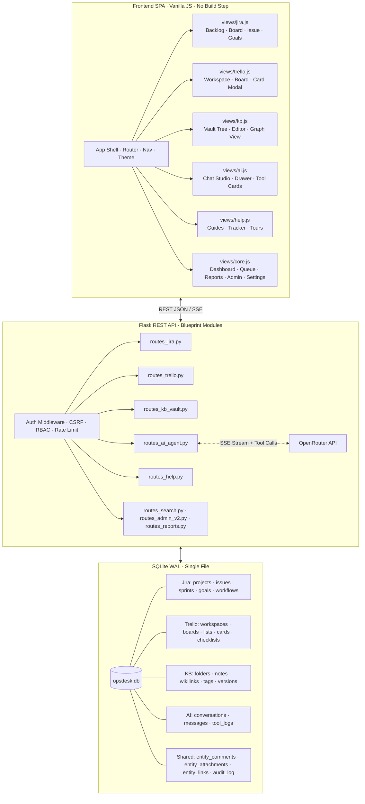
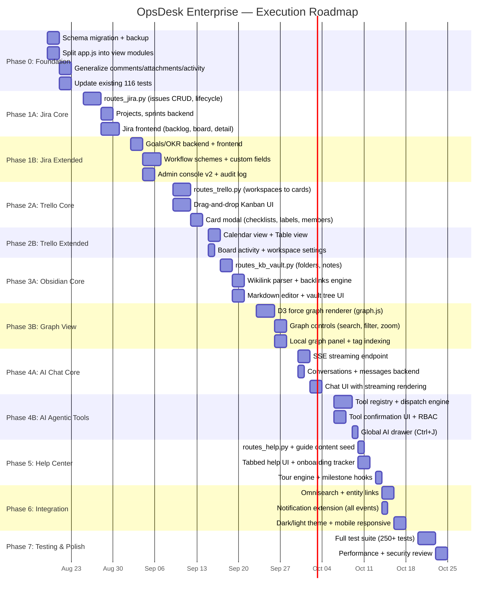

# OpsDesk Enterprise — Corrected Master Implementation Plan

> **Status:** Final · All 23 gaps fixed · All 8 architectural risks addressed  
> **Stack:** Flask + SQLite WAL + Vanilla JS SPA (zero build step)  
> **Estimated Effort:** ~44 working days (~9 weeks)

---

## 1. Executive Summary

This plan transforms OpsDesk from an internal IT helpdesk into **OpsDesk Enterprise** — a unified Work Operating System integrating five modules:

1. **Jira Enterprise Suite** — Structured issue tracking with Projects, Sprints, Goals/OKRs, and configurable Workflows
2. **Trello Workspaces** — Visual Kanban boards with drag-and-drop cards, checklists, and labels
3. **Obsidian Knowledge Base** — Markdown vault with `[[wikilinks]]`, bidirectional backlinks, and interactive D3 force-directed graph
4. **AI Agent & Copilot** — Autonomous OpenRouter-powered assistant with streaming chat, tool calling, and action execution
5. **Help Center & Trackers** — Tabbed guides, interactive onboarding checklists, and guided tours

### Key Architectural Decisions

| Decision | Rationale |
|---|---|
| **Replace, don't parallel** | `jira_issues` replaces `tickets`; `kb_notes` replaces `kb_articles`. No dual systems. |
| **Generalize shared entities** | Comments, attachments, and cross-links use `entity_type + entity_id` polymorphic pattern |
| **Preserve all existing features** | SLA engine, notifications, reports, CSAT, bulk ops, followers, auth — all migrated intact |
| **Split frontend, no bundler** | `app.js` splits into `views/*.js` modules loaded via `<script>` tags |
| **D3-force via CDN** | Only `d3-force` + `d3-dispatch` + `d3-timer` + `d3-quadtree` (~18KB total) for graph physics |
| **AI tool calls inherit user RBAC** | Every tool execution passes through the same permission checks as REST API calls |

---

## 2. Architecture Diagram



---

## 3. Data Migration Strategy

Migration happens in Phase 0. It is **atomic** — wrapped in a single transaction with rollback on failure. Existing tables are renamed to `_old_*` backups, not dropped, until Phase 7 verification passes.

### 3.1 Ticket → Jira Issue Migration

```sql
-- Step 1: Create default project for existing tickets
INSERT INTO jira_projects (key, name, description, lead_id, category, created_at)
VALUES ('OPS', 'Operations Desk', 'Migrated from legacy ticket system',
        (SELECT id FROM users WHERE role='admin' ORDER BY id LIMIT 1),
        'Service Desk', datetime('now'));

-- Step 2: Migrate tickets → jira_issues (preserving ALL fields)
INSERT INTO jira_issues (
    issue_key, project_id, issue_type, summary, description,
    category_id, requester_id, assignee_id, team_id,
    priority, status, blocked_reason, reopen_count,
    story_points, due_date,
    csat, csat_comment,
    created_at, updated_at, resolved_at, closed_at
)
SELECT
    ticket_ref,                                          -- preserve existing OPS-XXXX keys
    (SELECT id FROM jira_projects WHERE key='OPS'),      -- default project
    'Task',                                              -- default type
    subject, description,
    category_id, requester_id, assignee_id, team_id,
    priority, status, blocked_reason, reopen_count,
    NULL, NULL,                                          -- no story points or due dates yet
    csat, NULL,                                          -- csat_comment didn't exist before
    created_at, updated_at, resolved_at, closed_at
FROM tickets;

-- Step 3: Migrate comments → entity_comments
INSERT INTO entity_comments (entity_type, entity_id, author_id, body, visibility, created_at)
SELECT 'jira_issue',
       (SELECT ji.id FROM jira_issues ji WHERE ji.issue_key = 'OPS-' || tc.ticket_id),
       tc.author_id, tc.body, tc.visibility, tc.created_at
FROM ticket_comments tc
WHERE EXISTS (SELECT 1 FROM jira_issues ji WHERE ji.issue_key = 'OPS-' || tc.ticket_id);

-- Step 4: Migrate attachments → entity_attachments
INSERT INTO entity_attachments (entity_type, entity_id, uploaded_by, filename, file_size, storage_path, created_at)
SELECT 'jira_issue',
       (SELECT ji.id FROM jira_issues ji WHERE ji.issue_key = 'OPS-' || ta.ticket_id),
       ta.uploaded_by, ta.filename, ta.file_size, ta.storage_path, ta.created_at
FROM ticket_attachments ta
WHERE EXISTS (SELECT 1 FROM jira_issues ji WHERE ji.issue_key = 'OPS-' || ta.ticket_id);

-- Step 5: Migrate activity log → entity_activity
INSERT INTO entity_activity (entity_type, entity_id, actor_id, action, detail, created_at)
SELECT 'jira_issue',
       (SELECT ji.id FROM jira_issues ji WHERE ji.issue_key = 'OPS-' || act.ticket_id),
       act.actor_id, act.action,
       json_object('from_status', act.from_status, 'to_status', act.to_status, 'note', act.note),
       act.created_at
FROM ticket_activity act
WHERE EXISTS (SELECT 1 FROM jira_issues ji WHERE ji.issue_key = 'OPS-' || act.ticket_id);

-- Step 6: Migrate followers → entity_followers
INSERT INTO entity_followers (entity_type, entity_id, user_id, created_at)
SELECT 'jira_issue',
       (SELECT ji.id FROM jira_issues ji WHERE ji.issue_key = 'OPS-' || tf.ticket_id),
       tf.user_id, tf.created_at
FROM ticket_followers tf
WHERE EXISTS (SELECT 1 FROM jira_issues ji WHERE ji.issue_key = 'OPS-' || tf.ticket_id);

-- Step 7: Migrate SLA records (preserve intact — just re-point ticket_id → issue_id)
INSERT INTO issue_sla (issue_id, policy_id, first_response_at, breach_at, breached, response_met, resolution_met)
SELECT (SELECT ji.id FROM jira_issues ji WHERE ji.issue_key = 'OPS-' || ts.ticket_id),
       ts.policy_id, ts.first_response_at, ts.breach_at, ts.breached, ts.response_met, ts.resolution_met
FROM ticket_sla ts
WHERE EXISTS (SELECT 1 FROM jira_issues ji WHERE ji.issue_key = 'OPS-' || ts.ticket_id);

-- Step 8: Migrate notifications (re-point ticket_id → entity reference)
INSERT INTO notifications_v2 (user_id, entity_type, entity_id, kind, message, read, created_at)
SELECT n.user_id, 'jira_issue',
       (SELECT ji.id FROM jira_issues ji WHERE ji.issue_key = 'OPS-' || n.ticket_id),
       n.kind, n.message, n.read, n.created_at
FROM notifications n
WHERE n.ticket_id IS NOT NULL
  AND EXISTS (SELECT 1 FROM jira_issues ji WHERE ji.issue_key = 'OPS-' || n.ticket_id);

-- Step 9: Migrate ticket-KB links → entity_links
INSERT INTO entity_links (source_type, source_id, target_type, target_id, created_by, created_at)
SELECT 'jira_issue',
       (SELECT ji.id FROM jira_issues ji WHERE ji.issue_key = 'OPS-' || tkl.ticket_id),
       'kb_note',
       (SELECT kn.id FROM kb_notes kn WHERE kn.title = (SELECT ka.title FROM kb_articles ka WHERE ka.id = tkl.article_id)),
       tkl.linked_by_id, tkl.created_at
FROM ticket_kb_links tkl;
```

### 3.2 KB Articles → KB Notes Migration

```sql
-- Step 1: Create root folder for migrated articles
INSERT INTO kb_folders (name, parent_id) VALUES ('General', NULL);

-- Step 2: Create folders from existing categories
INSERT INTO kb_folders (name, parent_id)
SELECT DISTINCT c.name, (SELECT id FROM kb_folders WHERE name='General')
FROM categories c
WHERE c.id IN (SELECT DISTINCT category_id FROM kb_articles WHERE category_id IS NOT NULL);

-- Step 3: Migrate articles → notes
INSERT INTO kb_notes (
    title, content, frontmatter, folder_id, author_id,
    status, views, helpful_yes, helpful_no,
    created_at, updated_at
)
SELECT
    ka.title,
    ka.body,
    NULL,  -- frontmatter populated later
    COALESCE(
        (SELECT kf.id FROM kb_folders kf
         WHERE kf.name = (SELECT c.name FROM categories c WHERE c.id = ka.category_id)),
        (SELECT id FROM kb_folders WHERE name='General')
    ),
    ka.author_id,
    ka.status, ka.views,
    COALESCE((SELECT COUNT(*) FROM kb_feedback f WHERE f.article_id=ka.id AND f.helpful=1), 0),
    COALESCE((SELECT COUNT(*) FROM kb_feedback f WHERE f.article_id=ka.id AND f.helpful=0), 0),
    ka.created_at, ka.updated_at
FROM kb_articles ka;

-- Step 4: Migrate article versions → note versions
INSERT INTO kb_note_versions (note_id, title, body, saved_by_id, change_note, saved_at)
SELECT
    (SELECT kn.id FROM kb_notes kn WHERE kn.title = ka.title),
    kav.title, kav.body, kav.created_by, '', kav.created_at
FROM kb_article_versions kav
JOIN kb_articles ka ON ka.id = kav.article_id;

-- Step 5: Migrate article links → kb_wikilinks
INSERT INTO kb_wikilinks (source_note_id, target_note_id, created_at)
SELECT
    (SELECT kn.id FROM kb_notes kn WHERE kn.title = (SELECT ka.title FROM kb_articles ka WHERE ka.id = kal.source_id)),
    (SELECT kn.id FROM kb_notes kn WHERE kn.title = (SELECT ka.title FROM kb_articles ka WHERE ka.id = kal.target_id)),
    kal.created_at
FROM kb_article_links kal;

-- Step 6: Migrate feedback
INSERT INTO kb_note_feedback (note_id, user_id, helpful, comment, created_at)
SELECT
    (SELECT kn.id FROM kb_notes kn WHERE kn.title = (SELECT ka.title FROM kb_articles ka WHERE ka.id = kf.article_id)),
    kf.user_id, kf.helpful, kf.comment, kf.created_at
FROM kb_feedback kf;

-- Step 7: Migrate collections (preserve intact, re-point article_id → note_id)
INSERT INTO kb_collections_v2 (name, description, owner_id, created_at, updated_at)
SELECT name, description, owner_id, created_at, updated_at FROM kb_collections;

INSERT INTO kb_collection_notes (collection_id, note_id, position, created_at)
SELECT
    kca.collection_id,
    (SELECT kn.id FROM kb_notes kn WHERE kn.title = (SELECT ka.title FROM kb_articles ka WHERE ka.id = kca.article_id)),
    kca.position, kca.created_at
FROM kb_collection_articles kca;
```

### 3.3 Backup & Verification

```sql
-- Before migration: rename old tables as backups
ALTER TABLE tickets RENAME TO _backup_tickets;
ALTER TABLE ticket_comments RENAME TO _backup_ticket_comments;
ALTER TABLE ticket_attachments RENAME TO _backup_ticket_attachments;
ALTER TABLE ticket_activity RENAME TO _backup_ticket_activity;
ALTER TABLE ticket_followers RENAME TO _backup_ticket_followers;
ALTER TABLE ticket_sla RENAME TO _backup_ticket_sla;
ALTER TABLE ticket_kb_links RENAME TO _backup_ticket_kb_links;
ALTER TABLE kb_articles RENAME TO _backup_kb_articles;
ALTER TABLE kb_article_versions RENAME TO _backup_kb_article_versions;
ALTER TABLE kb_article_links RENAME TO _backup_kb_article_links;
ALTER TABLE kb_feedback RENAME TO _backup_kb_feedback;
ALTER TABLE kb_collections RENAME TO _backup_kb_collections;
ALTER TABLE kb_collection_articles RENAME TO _backup_kb_collection_articles;
ALTER TABLE notifications RENAME TO _backup_notifications;

-- After Phase 7 verification passes: DROP TABLE _backup_*;
```

---

## 4. Complete Database Schema

### 4.1 Core & Auth (preserved + extended)

```sql
CREATE TABLE IF NOT EXISTS teams (
    id      INTEGER PRIMARY KEY AUTOINCREMENT,
    name    TEXT NOT NULL UNIQUE
);

CREATE TABLE IF NOT EXISTS users (
    id       INTEGER PRIMARY KEY AUTOINCREMENT,
    name     TEXT NOT NULL,
    email    TEXT NOT NULL UNIQUE,
    password TEXT NOT NULL,
    role     TEXT NOT NULL,          -- requester | member | agent | manager | admin
    team_id  INTEGER REFERENCES teams(id) ON DELETE SET NULL,
    ai_key   TEXT,                   -- AES-GCM encrypted OpenRouter key
    ai_model TEXT                    -- user's chosen model ID
);

CREATE TABLE IF NOT EXISTS categories (
    id              INTEGER PRIMARY KEY AUTOINCREMENT,
    name            TEXT NOT NULL UNIQUE,
    description     TEXT,
    active          INTEGER NOT NULL DEFAULT 1,
    default_team_id INTEGER REFERENCES teams(id) ON DELETE SET NULL
);

CREATE TABLE IF NOT EXISTS password_resets (
    token      TEXT PRIMARY KEY,
    email      TEXT NOT NULL,
    expires_at TEXT NOT NULL,
    used       INTEGER NOT NULL DEFAULT 0
);

CREATE TABLE IF NOT EXISTS audit_log (
    id          INTEGER PRIMARY KEY AUTOINCREMENT,
    user_id     INTEGER REFERENCES users(id),
    action      TEXT NOT NULL,
    entity_type TEXT,
    entity_id   INTEGER,
    details     TEXT,               -- JSON of changed fields
    ip_address  TEXT,
    created_at  TEXT NOT NULL
);
CREATE INDEX IF NOT EXISTS idx_audit_user ON audit_log(user_id);
CREATE INDEX IF NOT EXISTS idx_audit_entity ON audit_log(entity_type, entity_id);
CREATE INDEX IF NOT EXISTS idx_audit_time ON audit_log(created_at);
```

### 4.2 Module 1: Jira Enterprise Suite

```sql
CREATE TABLE IF NOT EXISTS jira_projects (
    id          INTEGER PRIMARY KEY AUTOINCREMENT,
    key         TEXT NOT NULL UNIQUE,
    name        TEXT NOT NULL,
    description TEXT,
    lead_id     INTEGER REFERENCES users(id) ON DELETE SET NULL,
    category    TEXT NOT NULL DEFAULT 'Software',
    next_seq    INTEGER NOT NULL DEFAULT 1,    -- for issue key generation
    created_at  TEXT NOT NULL
);
CREATE INDEX IF NOT EXISTS idx_jira_proj_lead ON jira_projects(lead_id);

CREATE TABLE IF NOT EXISTS jira_sprints (
    id          INTEGER PRIMARY KEY AUTOINCREMENT,
    project_id  INTEGER NOT NULL REFERENCES jira_projects(id) ON DELETE CASCADE,
    name        TEXT NOT NULL,
    goal        TEXT,
    start_date  TEXT,
    end_date    TEXT,
    status      TEXT NOT NULL DEFAULT 'future',  -- future | active | closed
    velocity    INTEGER,                          -- calculated on close
    created_at  TEXT NOT NULL
);
CREATE INDEX IF NOT EXISTS idx_sprint_project ON jira_sprints(project_id);

CREATE TABLE IF NOT EXISTS jira_goals (
    id          INTEGER PRIMARY KEY AUTOINCREMENT,
    title       TEXT NOT NULL,
    description TEXT,
    owner_id    INTEGER REFERENCES users(id) ON DELETE SET NULL,
    target_date TEXT,
    quarter     TEXT,                              -- e.g. '2026-Q3'
    status      TEXT NOT NULL DEFAULT 'on_track',  -- on_track | at_risk | behind | achieved
    progress    INTEGER NOT NULL DEFAULT 0,        -- 0-100, auto-calculated
    parent_id   INTEGER REFERENCES jira_goals(id) ON DELETE SET NULL,
    created_at  TEXT NOT NULL,
    updated_at  TEXT NOT NULL
);

CREATE TABLE IF NOT EXISTS jira_issues (
    id              INTEGER PRIMARY KEY AUTOINCREMENT,
    issue_key       TEXT NOT NULL UNIQUE,
    project_id      INTEGER NOT NULL REFERENCES jira_projects(id) ON DELETE CASCADE,
    issue_type      TEXT NOT NULL DEFAULT 'Task',   -- Epic | Story | Task | Bug | Subtask
    summary         TEXT NOT NULL,
    description     TEXT,
    priority        TEXT NOT NULL DEFAULT 'normal',
    status          TEXT NOT NULL DEFAULT 'new',
    category_id     INTEGER REFERENCES categories(id),
    requester_id    INTEGER NOT NULL REFERENCES users(id),
    assignee_id     INTEGER REFERENCES users(id) ON DELETE SET NULL,
    team_id         INTEGER REFERENCES teams(id) ON DELETE SET NULL,
    sprint_id       INTEGER REFERENCES jira_sprints(id) ON DELETE SET NULL,
    parent_issue_id INTEGER REFERENCES jira_issues(id) ON DELETE SET NULL,
    epic_id         INTEGER REFERENCES jira_issues(id) ON DELETE SET NULL,
    goal_id         INTEGER REFERENCES jira_goals(id) ON DELETE SET NULL,
    story_points    INTEGER,
    due_date        TEXT,
    blocked_reason  TEXT,
    reopen_count    INTEGER NOT NULL DEFAULT 0,
    csat            INTEGER,
    csat_comment    TEXT,
    created_at      TEXT NOT NULL,
    updated_at      TEXT NOT NULL,
    resolved_at     TEXT,
    closed_at       TEXT
);
CREATE INDEX IF NOT EXISTS idx_issue_project ON jira_issues(project_id);
CREATE INDEX IF NOT EXISTS idx_issue_status ON jira_issues(status);
CREATE INDEX IF NOT EXISTS idx_issue_assignee ON jira_issues(assignee_id);
CREATE INDEX IF NOT EXISTS idx_issue_sprint ON jira_issues(sprint_id);
CREATE INDEX IF NOT EXISTS idx_issue_epic ON jira_issues(epic_id);
CREATE INDEX IF NOT EXISTS idx_issue_goal ON jira_issues(goal_id);
CREATE INDEX IF NOT EXISTS idx_issue_requester ON jira_issues(requester_id);
CREATE INDEX IF NOT EXISTS idx_issue_team ON jira_issues(team_id);

CREATE TABLE IF NOT EXISTS jira_issue_links (
    id              INTEGER PRIMARY KEY AUTOINCREMENT,
    source_issue_id INTEGER NOT NULL REFERENCES jira_issues(id) ON DELETE CASCADE,
    target_issue_id INTEGER NOT NULL REFERENCES jira_issues(id) ON DELETE CASCADE,
    link_type       TEXT NOT NULL,    -- blocks | is_blocked_by | duplicates | relates_to
    created_at      TEXT NOT NULL,
    UNIQUE(source_issue_id, target_issue_id, link_type)
);

-- SLA (migrated from ticket_sla, now references jira_issues)
CREATE TABLE IF NOT EXISTS sla_policies (
    id               INTEGER PRIMARY KEY AUTOINCREMENT,
    name             TEXT NOT NULL,
    priority         TEXT NOT NULL DEFAULT 'normal',
    category_id      INTEGER REFERENCES categories(id) ON DELETE SET NULL,
    response_hours   REAL NOT NULL,
    resolution_hours REAL NOT NULL
);

CREATE TABLE IF NOT EXISTS issue_sla (
    id               INTEGER PRIMARY KEY AUTOINCREMENT,
    issue_id         INTEGER NOT NULL UNIQUE REFERENCES jira_issues(id) ON DELETE CASCADE,
    policy_id        INTEGER REFERENCES sla_policies(id),
    first_response_at TEXT,
    breach_at        TEXT NOT NULL,
    breached         INTEGER NOT NULL DEFAULT 0,
    response_met     INTEGER,
    resolution_met   INTEGER
);

-- Workflow Schemes (configurable state machines per project)
CREATE TABLE IF NOT EXISTS jira_workflow_schemes (
    id          INTEGER PRIMARY KEY AUTOINCREMENT,
    project_id  INTEGER REFERENCES jira_projects(id) ON DELETE CASCADE,
    name        TEXT NOT NULL,
    transitions TEXT NOT NULL,      -- JSON: [{"from":"new","to":"in_progress","roles":["agent","admin"]}]
    created_at  TEXT NOT NULL
);

-- Custom Fields (EAV pattern)
CREATE TABLE IF NOT EXISTS jira_custom_field_defs (
    id          INTEGER PRIMARY KEY AUTOINCREMENT,
    project_id  INTEGER REFERENCES jira_projects(id) ON DELETE CASCADE,
    name        TEXT NOT NULL,
    field_type  TEXT NOT NULL,       -- text | number | date | select | user
    options     TEXT,                -- JSON array for select type
    required    INTEGER NOT NULL DEFAULT 0,
    position    INTEGER NOT NULL DEFAULT 0
);

CREATE TABLE IF NOT EXISTS jira_custom_field_values (
    id          INTEGER PRIMARY KEY AUTOINCREMENT,
    issue_id    INTEGER NOT NULL REFERENCES jira_issues(id) ON DELETE CASCADE,
    field_id    INTEGER NOT NULL REFERENCES jira_custom_field_defs(id) ON DELETE CASCADE,
    value_text  TEXT,
    value_num   REAL,
    value_date  TEXT,
    UNIQUE(issue_id, field_id)
);
```

### 4.3 Module 2: Trello Workspaces

```sql
CREATE TABLE IF NOT EXISTS trello_workspaces (
    id          INTEGER PRIMARY KEY AUTOINCREMENT,
    name        TEXT NOT NULL,
    description TEXT,
    owner_id    INTEGER NOT NULL REFERENCES users(id),
    visibility  TEXT NOT NULL DEFAULT 'workspace',  -- private | workspace | public
    created_at  TEXT NOT NULL
);

CREATE TABLE IF NOT EXISTS trello_workspace_members (
    workspace_id INTEGER NOT NULL REFERENCES trello_workspaces(id) ON DELETE CASCADE,
    user_id      INTEGER NOT NULL REFERENCES users(id) ON DELETE CASCADE,
    role         TEXT NOT NULL DEFAULT 'member',     -- admin | member | viewer
    joined_at    TEXT NOT NULL,
    PRIMARY KEY (workspace_id, user_id)
);

CREATE TABLE IF NOT EXISTS trello_boards (
    id           INTEGER PRIMARY KEY AUTOINCREMENT,
    workspace_id INTEGER NOT NULL REFERENCES trello_workspaces(id) ON DELETE CASCADE,
    title        TEXT NOT NULL,
    description  TEXT,
    background   TEXT DEFAULT '#0079BF',
    is_starred   INTEGER NOT NULL DEFAULT 0,
    is_archived  INTEGER NOT NULL DEFAULT 0,
    created_at   TEXT NOT NULL
);
CREATE INDEX IF NOT EXISTS idx_board_workspace ON trello_boards(workspace_id);

CREATE TABLE IF NOT EXISTS trello_lists (
    id          INTEGER PRIMARY KEY AUTOINCREMENT,
    board_id    INTEGER NOT NULL REFERENCES trello_boards(id) ON DELETE CASCADE,
    title       TEXT NOT NULL,
    position    REAL NOT NULL DEFAULT 65535,
    is_archived INTEGER NOT NULL DEFAULT 0,
    created_at  TEXT NOT NULL
);
CREATE INDEX IF NOT EXISTS idx_list_board ON trello_lists(board_id);

CREATE TABLE IF NOT EXISTS trello_cards (
    id          INTEGER PRIMARY KEY AUTOINCREMENT,
    list_id     INTEGER NOT NULL REFERENCES trello_lists(id) ON DELETE CASCADE,
    title       TEXT NOT NULL,
    description TEXT,
    position    REAL NOT NULL DEFAULT 65535,
    due_date    TEXT,
    is_complete INTEGER NOT NULL DEFAULT 0,
    cover_color TEXT,
    created_at  TEXT NOT NULL,
    updated_at  TEXT NOT NULL
);
CREATE INDEX IF NOT EXISTS idx_card_list ON trello_cards(list_id);

CREATE TABLE IF NOT EXISTS trello_card_members (
    card_id  INTEGER NOT NULL REFERENCES trello_cards(id) ON DELETE CASCADE,
    user_id  INTEGER NOT NULL REFERENCES users(id) ON DELETE CASCADE,
    PRIMARY KEY (card_id, user_id)
);

CREATE TABLE IF NOT EXISTS trello_checklists (
    id       INTEGER PRIMARY KEY AUTOINCREMENT,
    card_id  INTEGER NOT NULL REFERENCES trello_cards(id) ON DELETE CASCADE,
    title    TEXT NOT NULL DEFAULT 'Checklist',
    position INTEGER NOT NULL DEFAULT 0
);

CREATE TABLE IF NOT EXISTS trello_checklist_items (
    id           INTEGER PRIMARY KEY AUTOINCREMENT,
    checklist_id INTEGER NOT NULL REFERENCES trello_checklists(id) ON DELETE CASCADE,
    content      TEXT NOT NULL,
    is_checked   INTEGER NOT NULL DEFAULT 0,
    position     REAL NOT NULL DEFAULT 0
);

CREATE TABLE IF NOT EXISTS trello_labels (
    id       INTEGER PRIMARY KEY AUTOINCREMENT,
    board_id INTEGER NOT NULL REFERENCES trello_boards(id) ON DELETE CASCADE,
    name     TEXT NOT NULL,
    color    TEXT NOT NULL
);

CREATE TABLE IF NOT EXISTS trello_card_labels (
    card_id  INTEGER NOT NULL REFERENCES trello_cards(id) ON DELETE CASCADE,
    label_id INTEGER NOT NULL REFERENCES trello_labels(id) ON DELETE CASCADE,
    PRIMARY KEY (card_id, label_id)
);
```

### 4.4 Module 3: Obsidian Knowledge Base

```sql
CREATE TABLE IF NOT EXISTS kb_folders (
    id        INTEGER PRIMARY KEY AUTOINCREMENT,
    name      TEXT NOT NULL,
    parent_id INTEGER REFERENCES kb_folders(id) ON DELETE CASCADE,
    UNIQUE(name, parent_id)
);

CREATE TABLE IF NOT EXISTS kb_notes (
    id          INTEGER PRIMARY KEY AUTOINCREMENT,
    folder_id   INTEGER REFERENCES kb_folders(id) ON DELETE SET NULL,
    title       TEXT NOT NULL,
    content     TEXT NOT NULL DEFAULT '',
    frontmatter TEXT,                    -- JSON metadata (tags, aliases, etc.)
    author_id   INTEGER NOT NULL REFERENCES users(id),
    status      TEXT NOT NULL DEFAULT 'draft',  -- draft | published
    views       INTEGER NOT NULL DEFAULT 0,
    helpful_yes INTEGER NOT NULL DEFAULT 0,
    helpful_no  INTEGER NOT NULL DEFAULT 0,
    created_at  TEXT NOT NULL,
    updated_at  TEXT NOT NULL,
    UNIQUE(folder_id, title)
);
CREATE INDEX IF NOT EXISTS idx_note_folder ON kb_notes(folder_id);
CREATE INDEX IF NOT EXISTS idx_note_author ON kb_notes(author_id);
CREATE INDEX IF NOT EXISTS idx_note_status ON kb_notes(status);

CREATE TABLE IF NOT EXISTS kb_wikilinks (
    source_note_id INTEGER NOT NULL REFERENCES kb_notes(id) ON DELETE CASCADE,
    target_note_id INTEGER NOT NULL REFERENCES kb_notes(id) ON DELETE CASCADE,
    alias          TEXT,                 -- display text from [[Target|alias]]
    created_at     TEXT NOT NULL,
    PRIMARY KEY (source_note_id, target_note_id)
);
CREATE INDEX IF NOT EXISTS idx_wikilink_target ON kb_wikilinks(target_note_id);

CREATE TABLE IF NOT EXISTS kb_tags (
    id   INTEGER PRIMARY KEY AUTOINCREMENT,
    name TEXT NOT NULL UNIQUE
);

CREATE TABLE IF NOT EXISTS kb_note_tags (
    note_id INTEGER NOT NULL REFERENCES kb_notes(id) ON DELETE CASCADE,
    tag_id  INTEGER NOT NULL REFERENCES kb_tags(id) ON DELETE CASCADE,
    PRIMARY KEY (note_id, tag_id)
);
CREATE INDEX IF NOT EXISTS idx_notetag_tag ON kb_note_tags(tag_id);

CREATE TABLE IF NOT EXISTS kb_note_versions (
    id         INTEGER PRIMARY KEY AUTOINCREMENT,
    note_id    INTEGER NOT NULL REFERENCES kb_notes(id) ON DELETE CASCADE,
    title      TEXT NOT NULL,
    body       TEXT NOT NULL,
    saved_by_id INTEGER REFERENCES users(id),
    change_note TEXT,
    saved_at   TEXT NOT NULL
);

CREATE TABLE IF NOT EXISTS kb_note_feedback (
    id         INTEGER PRIMARY KEY AUTOINCREMENT,
    note_id    INTEGER NOT NULL REFERENCES kb_notes(id) ON DELETE CASCADE,
    user_id    INTEGER REFERENCES users(id) ON DELETE SET NULL,
    helpful    INTEGER NOT NULL,
    comment    TEXT,
    created_at TEXT NOT NULL
);

-- Collections (migrated from kb_collections)
CREATE TABLE IF NOT EXISTS kb_collections_v2 (
    id          INTEGER PRIMARY KEY AUTOINCREMENT,
    name        TEXT NOT NULL,
    description TEXT,
    owner_id    INTEGER REFERENCES users(id),
    created_at  TEXT NOT NULL,
    updated_at  TEXT NOT NULL
);

CREATE TABLE IF NOT EXISTS kb_collection_notes (
    collection_id INTEGER NOT NULL REFERENCES kb_collections_v2(id) ON DELETE CASCADE,
    note_id       INTEGER NOT NULL REFERENCES kb_notes(id) ON DELETE CASCADE,
    position      INTEGER NOT NULL DEFAULT 0,
    created_at    TEXT NOT NULL,
    PRIMARY KEY (collection_id, note_id)
);
```

### 4.5 Module 4: AI Agent & Copilot

```sql
CREATE TABLE IF NOT EXISTS ai_conversations (
    id         INTEGER PRIMARY KEY AUTOINCREMENT,
    user_id    INTEGER NOT NULL REFERENCES users(id) ON DELETE CASCADE,
    title      TEXT NOT NULL DEFAULT 'New Chat',
    created_at TEXT NOT NULL,
    updated_at TEXT NOT NULL
);
CREATE INDEX IF NOT EXISTS idx_aiconv_user ON ai_conversations(user_id);

CREATE TABLE IF NOT EXISTS ai_messages (
    id              INTEGER PRIMARY KEY AUTOINCREMENT,
    conversation_id INTEGER NOT NULL REFERENCES ai_conversations(id) ON DELETE CASCADE,
    role            TEXT NOT NULL,       -- user | assistant | tool_call | tool_result | system
    content         TEXT NOT NULL,
    tool_name       TEXT,                -- for tool_call/tool_result messages
    tool_args       TEXT,                -- JSON arguments
    tool_status     TEXT,                -- pending_confirm | approved | rejected | executed | failed
    tokens_prompt   INTEGER DEFAULT 0,
    tokens_completion INTEGER DEFAULT 0,
    cost_usd        REAL DEFAULT 0.0,
    created_at      TEXT NOT NULL
);
CREATE INDEX IF NOT EXISTS idx_aimsg_conv ON ai_messages(conversation_id);
```

### 4.6 Cross-Cutting Shared Tables

```sql
-- Polymorphic comments (replaces ticket_comments for ALL entity types)
CREATE TABLE IF NOT EXISTS entity_comments (
    id          INTEGER PRIMARY KEY AUTOINCREMENT,
    entity_type TEXT NOT NULL,       -- jira_issue | trello_card | kb_note
    entity_id   INTEGER NOT NULL,
    author_id   INTEGER NOT NULL REFERENCES users(id),
    body        TEXT NOT NULL,
    visibility  TEXT NOT NULL DEFAULT 'public',  -- public | internal
    created_at  TEXT NOT NULL
);
CREATE INDEX IF NOT EXISTS idx_ecomment_entity ON entity_comments(entity_type, entity_id);

-- Polymorphic attachments (replaces ticket_attachments)
CREATE TABLE IF NOT EXISTS entity_attachments (
    id           INTEGER PRIMARY KEY AUTOINCREMENT,
    entity_type  TEXT NOT NULL,
    entity_id    INTEGER NOT NULL,
    uploaded_by  INTEGER NOT NULL REFERENCES users(id),
    filename     TEXT NOT NULL,
    file_size    INTEGER,
    storage_path TEXT NOT NULL,
    created_at   TEXT NOT NULL
);
CREATE INDEX IF NOT EXISTS idx_eattach_entity ON entity_attachments(entity_type, entity_id);

-- Polymorphic activity log (replaces ticket_activity)
CREATE TABLE IF NOT EXISTS entity_activity (
    id          INTEGER PRIMARY KEY AUTOINCREMENT,
    entity_type TEXT NOT NULL,
    entity_id   INTEGER NOT NULL,
    actor_id    INTEGER REFERENCES users(id),
    action      TEXT NOT NULL,
    detail      TEXT,               -- JSON with from/to values
    created_at  TEXT NOT NULL
);
CREATE INDEX IF NOT EXISTS idx_eactivity_entity ON entity_activity(entity_type, entity_id);

-- Polymorphic followers (replaces ticket_followers)
CREATE TABLE IF NOT EXISTS entity_followers (
    entity_type TEXT NOT NULL,
    entity_id   INTEGER NOT NULL,
    user_id     INTEGER NOT NULL REFERENCES users(id) ON DELETE CASCADE,
    created_at  TEXT NOT NULL,
    PRIMARY KEY (entity_type, entity_id, user_id)
);

-- Cross-module links (Jira issue ↔ Trello card ↔ KB note)
CREATE TABLE IF NOT EXISTS entity_links (
    id          INTEGER PRIMARY KEY AUTOINCREMENT,
    source_type TEXT NOT NULL,
    source_id   INTEGER NOT NULL,
    target_type TEXT NOT NULL,
    target_id   INTEGER NOT NULL,
    created_by  INTEGER REFERENCES users(id),
    created_at  TEXT NOT NULL,
    UNIQUE(source_type, source_id, target_type, target_id)
);
CREATE INDEX IF NOT EXISTS idx_elink_source ON entity_links(source_type, source_id);
CREATE INDEX IF NOT EXISTS idx_elink_target ON entity_links(target_type, target_id);

-- Notifications (v2 — supports all entity types, not just tickets)
CREATE TABLE IF NOT EXISTS notifications_v2 (
    id          INTEGER PRIMARY KEY AUTOINCREMENT,
    user_id     INTEGER NOT NULL REFERENCES users(id) ON DELETE CASCADE,
    entity_type TEXT,               -- jira_issue | trello_card | kb_note | goal | ai_chat
    entity_id   INTEGER,
    kind        TEXT NOT NULL,
    message     TEXT NOT NULL,
    read        INTEGER NOT NULL DEFAULT 0,
    created_at  TEXT NOT NULL
);
CREATE INDEX IF NOT EXISTS idx_notif_user ON notifications_v2(user_id, read);

-- Onboarding progress
CREATE TABLE IF NOT EXISTS user_milestones (
    user_id      INTEGER NOT NULL REFERENCES users(id) ON DELETE CASCADE,
    milestone_key TEXT NOT NULL,
    completed_at TEXT NOT NULL,
    PRIMARY KEY (user_id, milestone_key)
);
```

---

## 5. Complete API Endpoints

### 5.1 Jira Suite (`routes_jira.py`)

| Method | Path | Description | Auth |
|---|---|---|---|
| `GET` | `/api/jira/projects` | List all projects (user sees their team's) | Login |
| `POST` | `/api/jira/projects` | Create project | Admin |
| `GET` | `/api/jira/projects/<id>` | Get project detail + stats | Login |
| `PATCH` | `/api/jira/projects/<id>` | Update project (name, lead, desc) | Admin/Lead |
| `GET` | `/api/jira/issues` | List/filter/search issues (paginated) | Login (RBAC scoped) |
| `POST` | `/api/jira/issues` | Create issue | Login |
| `GET` | `/api/jira/issues/<id_or_key>` | Get issue detail (comments, activity, SLA, custom fields) | Login (can_view) |
| `PATCH` | `/api/jira/issues/<id_or_key>` | Update issue fields | Login (can_edit) |
| `POST` | `/api/jira/issues/<id>/assign` | Assign/unassign/claim | Agent+ |
| `POST` | `/api/jira/issues/<id>/status` | Transition status (lifecycle validated) | Login (role-gated per transition) |
| `POST` | `/api/jira/issues/<id>/priority` | Change priority (re-evaluates SLA) | Agent+ |
| `POST` | `/api/jira/issues/<id>/reopen` | Reopen within window | Requester/Agent+ |
| `GET` | `/api/jira/issues/<id>/sla` | Get live SLA status | Agent+ |
| `POST` | `/api/jira/issues/<id>/rate` | Submit CSAT rating (1-5) | Requester |
| `POST` | `/api/jira/issues/bulk` | Bulk assign/status/priority/close | Agent+ |
| `GET` | `/api/jira/issues/export.csv` | Export filtered issues as CSV | Manager+ |
| `GET` | `/api/jira/sprints` | List sprints for project | Login |
| `POST` | `/api/jira/sprints` | Create sprint | Manager/Admin |
| `POST` | `/api/jira/sprints/<id>/start` | Start sprint | Manager/Admin |
| `POST` | `/api/jira/sprints/<id>/complete` | Complete sprint (calc velocity) | Manager/Admin |
| `GET` | `/api/jira/goals` | List goals with progress | Login |
| `POST` | `/api/jira/goals` | Create goal/OKR | Manager/Admin |
| `PATCH` | `/api/jira/goals/<id>` | Update goal | Owner/Admin |
| `GET` | `/api/jira/goals/<id>/progress` | Auto-calculate progress from linked issues | Login |
| `GET` | `/api/jira/teams` | List teams with capacity | Login |
| `GET` | `/api/jira/admin/workflows` | List workflow schemes | Admin |
| `POST` | `/api/jira/admin/workflows` | Create/update workflow scheme | Admin |
| `GET` | `/api/jira/admin/custom-fields` | List custom field definitions | Admin |
| `POST` | `/api/jira/admin/custom-fields` | Create custom field | Admin |
| `GET` | `/api/sla/policies` | List SLA policies | Manager+ |
| `POST` | `/api/sla/policies` | Create SLA policy | Admin |
| `PATCH` | `/api/sla/policies/<id>` | Update SLA policy | Admin |
| `DELETE` | `/api/sla/policies/<id>` | Delete SLA policy | Admin |

### 5.2 Trello Workspaces (`routes_trello.py`)

| Method | Path | Description | Auth |
|---|---|---|---|
| `GET` | `/api/trello/workspaces` | List user's workspaces | Login |
| `POST` | `/api/trello/workspaces` | Create workspace | Login |
| `PATCH` | `/api/trello/workspaces/<id>` | Update workspace | WS Admin |
| `GET` | `/api/trello/workspaces/<id>/members` | List workspace members | WS Member |
| `POST` | `/api/trello/workspaces/<id>/members` | Add member with role | WS Admin |
| `DELETE` | `/api/trello/workspaces/<id>/members/<uid>` | Remove member | WS Admin |
| `GET` | `/api/trello/boards` | List boards for workspace | WS Member |
| `POST` | `/api/trello/boards` | Create board | WS Member+ |
| `GET` | `/api/trello/boards/<id>` | Get board with lists, cards, labels | WS Member |
| `PATCH` | `/api/trello/boards/<id>` | Update board (title, bg, starred) | WS Member |
| `POST` | `/api/trello/boards/<id>/lists` | Create list | WS Member |
| `PATCH` | `/api/trello/lists/<id>` | Update list (title, position, archive) | WS Member |
| `POST` | `/api/trello/cards` | Create card | WS Member |
| `PATCH` | `/api/trello/cards/<id>` | Update card (title, desc, due, cover) | WS Member |
| `POST` | `/api/trello/cards/<id>/move` | Move card (list_id, position) | WS Member |
| `DELETE` | `/api/trello/cards/<id>` | Archive/delete card | WS Member |
| `POST` | `/api/trello/cards/<id>/members` | Add card member | WS Member |
| `DELETE` | `/api/trello/cards/<id>/members/<uid>` | Remove card member | WS Member |
| `POST` | `/api/trello/cards/<id>/checklists` | Add checklist | WS Member |
| `PATCH` | `/api/trello/checklists/<id>` | Update checklist title | WS Member |
| `POST` | `/api/trello/checklists/<id>/items` | Add checklist item | WS Member |
| `PATCH` | `/api/trello/checklist-items/<id>` | Toggle/update item | WS Member |
| `POST` | `/api/trello/boards/<id>/labels` | Create label | WS Member |
| `POST` | `/api/trello/cards/<id>/labels` | Attach label to card | WS Member |
| `DELETE` | `/api/trello/cards/<id>/labels/<lid>` | Remove label from card | WS Member |

### 5.3 Obsidian KB (`routes_kb_vault.py`)

| Method | Path | Description | Auth |
|---|---|---|---|
| `GET` | `/api/kb/tree` | Get full folder/note hierarchy tree | Login |
| `POST` | `/api/kb/folders` | Create folder | Agent+ |
| `PATCH` | `/api/kb/folders/<id>` | Rename/move folder | Agent+ |
| `DELETE` | `/api/kb/folders/<id>` | Delete folder (moves notes to parent) | Admin |
| `GET` | `/api/kb/notes` | List/search/filter notes (paginated) | Login (RBAC) |
| `POST` | `/api/kb/notes` | Create note (extracts wikilinks + tags) | Agent+ |
| `GET` | `/api/kb/notes/<id>` | Get note + backlinks + local graph data | Login (RBAC) |
| `PATCH` | `/api/kb/notes/<id>` | Update note (re-extract wikilinks + tags, create version) | Agent+ |
| `DELETE` | `/api/kb/notes/<id>` | Delete note | Admin |
| `POST` | `/api/kb/notes/<id>/publish` | Publish note | Agent+ |
| `POST` | `/api/kb/notes/<id>/feedback` | Submit helpful vote | Login |
| `GET` | `/api/kb/notes/<id>/versions` | Get version history | Login |
| `GET` | `/api/kb/notes/<id>/versions/<vid>/diff` | Get line-level diff | Login |
| `GET` | `/api/kb/graph` | Get all nodes + edges for graph view | Login |
| `GET` | `/api/kb/graph/local/<id>` | Get 1-2 hop neighbor subgraph | Login |
| `GET` | `/api/kb/tags` | List all tags with note counts | Login |
| `GET` | `/api/kb/suggest` | Pre-submit article suggestions (keyword matching) | Login |
| `GET` | `/api/kb/collections` | List collections | Login |
| `POST` | `/api/kb/collections` | Create collection | Agent+ |
| `POST` | `/api/kb/notes/<id>/draft-from-ticket` | AI-draft from ticket context | Agent+ |
| `GET` | `/api/kb/analytics` | KB health dashboard data | Manager+ |

### 5.4 AI Agent (`routes_ai_agent.py`)

| Method | Path | Description | Auth |
|---|---|---|---|
| `GET` | `/api/ai/conversations` | List user's chat sessions (paginated) | Login |
| `POST` | `/api/ai/conversations` | Create new chat session | Login |
| `DELETE` | `/api/ai/conversations/<id>` | Delete chat session | Login (owner) |
| `GET` | `/api/ai/conversations/<id>/messages` | Get message history | Login (owner) |
| `POST` | `/api/ai/chat/<conv_id>` | Send message → SSE streaming response | Login (owner, rate-limited) |
| `POST` | `/api/ai/tool-confirm/<msg_id>` | Approve or reject tool execution | Login (owner) |
| `GET` | `/api/ai/models` | Fetch dynamic model catalog from OpenRouter | Login |
| `GET` | `/api/ai/usage` | Get user's token/cost usage summary | Login |
| `GET` | `/api/ai/suggest-reply/<issue_id>` | Draft reply (legacy, preserved) | Agent+ |
| `GET` | `/api/ai/summarize/<issue_id>` | Summarize issue (legacy, preserved) | Agent+ |
| `GET` | `/api/ai/suggest-priority/<issue_id>` | Suggest priority (legacy, preserved) | Agent+ |

### 5.5 Help Center (`routes_help.py`)

| Method | Path | Description | Auth |
|---|---|---|---|
| `GET` | `/api/help/guides` | Get tabbed guide structure | Login |
| `GET` | `/api/help/guides/<tab_key>` | Get guide content for specific tab | Login |
| `GET` | `/api/help/progress` | Get user's onboarding milestones | Login |
| `POST` | `/api/help/progress` | Record milestone completion | Login |
| `GET` | `/api/help/shortcuts` | Get keyboard shortcuts reference | Login |
| `GET` | `/api/help/tours/<tour_key>` | Get tour step definitions | Login |

### 5.6 Cross-Cutting Endpoints

| Method | Path | Description | Auth |
|---|---|---|---|
| `GET` | `/api/search` | Global omnisearch (`?q=...&scope=all\|issues\|cards\|notes`) | Login |
| `POST` | `/api/comments` | Add comment (`entity_type`, `entity_id`, `body`, `visibility`) | Login |
| `GET` | `/api/comments` | List comments for entity | Login |
| `POST` | `/api/attachments` | Upload attachment to entity | Login |
| `GET` | `/api/attachments/<id>` | Download attachment | Login (can_view) |
| `POST` | `/api/entity-links` | Create cross-entity link | Login |
| `DELETE` | `/api/entity-links/<id>` | Remove cross-entity link | Login |
| `GET` | `/api/audit-log` | Browse audit log (paginated, filtered) | Admin |
| `GET` | `/api/dashboard` | Role-aware dashboard data | Agent+ |
| `GET` | `/api/dashboard/action-center` | Manager action center | Manager+ |
| `GET` | `/api/reports/summary` | Report summary with filters | Manager+ |
| `GET` | `/api/reports/workload` | Agent workload report | Manager+ |
| `GET` | `/api/reports/sla` | SLA attainment report | Manager+ |
| `GET` | `/api/reports/trend` | Time-series trend data | Manager+ |
| `GET` | `/api/notifications` | List notifications (paginated) | Login |
| `POST` | `/api/notifications/<id>/read` | Mark notification read | Login |
| `POST` | `/api/notifications/read-all` | Mark all read | Login |
| `GET` | `/api/meta` | System metadata (teams, categories, statuses) | Login |

---

## 6. Frontend Architecture

### 6.1 File Structure

```
static/
├── css/
│   ├── tokens.css          (preserved — HSL design tokens, dark/light)
│   ├── app.css             (preserved — base components, layout, responsive)
│   ├── jira.css            (new — backlog, sprint board, issue detail)
│   ├── trello.css          (new — kanban board, card modal, drag states)
│   ├── kb.css              (new — vault tree, editor, graph canvas)
│   └── ai.css              (new — chat bubbles, tool cards, drawer)
├── js/
│   ├── api.js              (extended — new API methods for all modules)
│   ├── app.js              (slimmed — router, shell, shared utils only)
│   ├── graph.js            (new — D3 force graph renderer)
│   └── views/
│       ├── core.js         (extracted — dashboard, queue, reports, admin, settings, auth)
│       ├── jira.js         (new — backlog, board, issue detail, goals, sprints)
│       ├── trello.js       (new — workspace, board, card modal, drag-drop)
│       ├── kb.js           (new — vault tree, note editor, backlinks, graph)
│       ├── ai.js           (new — chat studio, drawer, tool confirmation)
│       └── help.js         (new — guide tabs, tracker, tour engine)
└── favicon.png
```

### 6.2 Script Loading (`templates/index.html`)

```html
<!-- CDN: D3 force module only (~18KB) -->
<script src="https://cdn.jsdelivr.net/npm/d3-dispatch@3/dist/d3-dispatch.min.js"></script>
<script src="https://cdn.jsdelivr.net/npm/d3-quadtree@3/dist/d3-quadtree.min.js"></script>
<script src="https://cdn.jsdelivr.net/npm/d3-timer@3/dist/d3-timer.min.js"></script>
<script src="https://cdn.jsdelivr.net/npm/d3-force@3/dist/d3-force.min.js"></script>

<!-- Core -->
<script src="/static/js/api.js"></script>
<script src="/static/js/graph.js"></script>

<!-- View Modules (register on global OpsDesk.views) -->
<script src="/static/js/views/core.js"></script>
<script src="/static/js/views/jira.js"></script>
<script src="/static/js/views/trello.js"></script>
<script src="/static/js/views/kb.js"></script>
<script src="/static/js/views/ai.js"></script>
<script src="/static/js/views/help.js"></script>

<!-- Main Entry (router + shell, must be last) -->
<script src="/static/js/app.js"></script>
```

### 6.3 View Function Registry

Each view module registers on a shared namespace. The router calls view functions by name:

```javascript
// In views/jira.js
(function(OD) {
  OD.views.jiraBacklog    = function(projectId) { /* ... */ };
  OD.views.jiraBoard      = function(projectId) { /* ... */ };
  OD.views.jiraIssue      = function(issueId)   { /* ... */ };
  OD.views.jiraGoals      = function()          { /* ... */ };
  OD.views.jiraAdmin      = function()          { /* ... */ };
})(window.OpsDesk = window.OpsDesk || { views: {} });
```

### 6.4 Route Map

| Hash Route | View Function | Module |
|---|---|---|
| `#/login` | `viewLogin()` | core.js |
| `#/dashboard` | `viewDashboard()` | core.js |
| `#/queue` | `viewQueue()` | core.js (→ uses Jira data) |
| `#/my` | `viewMyRequests()` | core.js |
| `#/reports` | `viewReports()` | core.js |
| `#/settings` | `viewSettings()` | core.js |
| `#/admin` | `viewAdmin()` | core.js |
| `#/notifs` | `viewNotifications()` | core.js |
| `#/jira/projects` | `jiraProjects()` | jira.js |
| `#/jira/backlog/<projId>` | `jiraBacklog(projId)` | jira.js |
| `#/jira/board/<projId>` | `jiraBoard(projId)` | jira.js |
| `#/jira/issue/<key>` | `jiraIssue(key)` | jira.js |
| `#/jira/goals` | `jiraGoals()` | jira.js |
| `#/jira/sprints/<projId>` | `jiraSprints(projId)` | jira.js |
| `#/trello` | `trelloHome()` | trello.js |
| `#/trello/board/<id>` | `trelloBoard(id)` | trello.js |
| `#/kb` | `kbHome()` | kb.js |
| `#/kb/vault` | `kbVault()` | kb.js |
| `#/kb/note/<id>` | `kbNote(id)` | kb.js |
| `#/kb/edit/<id>` | `kbEdit(id)` | kb.js |
| `#/kb/new` | `kbNew()` | kb.js |
| `#/kb/graph` | `kbGraph()` | kb.js |
| `#/kb/manage` | `kbManage()` | kb.js |
| `#/kb/collections` | `kbCollections()` | kb.js |
| `#/ai` | `aiChat()` | ai.js |
| `#/ai/chat/<convId>` | `aiChatSession(convId)` | ai.js |
| `#/help` | `helpCenter()` | help.js |

### 6.5 Navigation Sidebar Structure

```
── Jira Workflows
   ├── Projects
   ├── Backlog
   ├── Active Sprint
   ├── Goals & OKRs
── Trello Boards
   ├── [Workspace Switcher]
   ├── My Boards
   ├── Starred Boards
── Knowledge Base
   ├── Vault Explorer
   ├── Graph View
   ├── Manage Notes
   ├── Collections
── AI Copilot
── Help Center
── Reports           (Manager+)
── Admin             (Admin)
── Settings
── Notifications (🔔 badge)
```

### 6.6 Keyboard Shortcuts

| Key | Action |
|---|---|
| `C` | Quick create (issue or card based on current view) |
| `Ctrl+J` / `Cmd+J` | Toggle AI Copilot drawer |
| `Ctrl+K` / `Cmd+K` | Open Omnisearch palette |
| `?` | Show keyboard shortcuts modal |
| `Escape` | Close modal / drawer / palette |
| `G then D` | Go to Dashboard |
| `G then B` | Go to Backlog |
| `G then K` | Go to KB Vault |

---

## 7–11. Module Specifications

### Module 1: Jira Suite — Backend

**File:** `app/routes_jira.py` (replaces `routes_tickets.py`)

- Migrates ALL existing ticket endpoint logic (create, list, detail, update, assign, status, priority, reopen, comments, attachments, KB links, CSAT, bulk, export) to operate on `jira_issues` table
- Issue key generation: `{project.key}-{project.next_seq}` → atomically increment `next_seq`
- Sprint management: Only 1 active sprint per project at a time. `POST /sprints/<id>/complete` moves incomplete issues back to backlog, calculates velocity
- Goals auto-progress: `GET /goals/<id>/progress` → `SELECT SUM(CASE WHEN status IN ('resolved','closed') THEN story_points ELSE 0 END) * 100.0 / NULLIF(SUM(story_points), 0) FROM jira_issues WHERE goal_id = ?`
- Workflow schemes: `transitions` JSON validated on `POST /issues/<id>/status` — checks if `(current_status → new_status)` is allowed for user's role

### Module 1: Jira Suite — Frontend (`views/jira.js`)

- **`jiraBacklog(projectId)`:** Split view — top: sprint bucket(s) with drag-drop zone; bottom: unassigned backlog list. Dragging an issue from backlog to sprint bucket calls `PATCH /issues/<id>` with `sprint_id`
- **`jiraBoard(projectId)`:** Kanban columns by status (configurable from workflow scheme). Cards show key, summary, assignee avatar, priority dot, story points badge
- **`jiraIssue(key)`:** Full detail view — Left: summary, description (markdown rendered), subtasks list, comment thread; Right: metadata sidebar (status, assignee, priority, sprint, epic, goal, SLA status, custom fields, activity timeline)
- **`jiraGoals()`:** Goal cards with progress bars. Click to expand linked issues/epics. Status color coding (green/yellow/red)

### Module 2: Trello — Backend (`routes_trello.py`)

- Workspace membership enforced on all board/card operations via `_check_ws_member(workspace_id, user_id)` helper
- Position management: `REAL` values. On move, new position = `(prev.position + next.position) / 2`. Rebalance (renumber all to integers) when any position has >10 decimal digits
- Card move endpoint: Updates `list_id` and `position` atomically, logs activity

### Module 2: Trello — Frontend (`views/trello.js`)

- **`trelloBoard(boardId)`:** Horizontal flexbox of list columns. Each column: title, card stack, "Add card" input at bottom
- **Drag-and-drop:** HTML5 `dragstart`, `dragover`, `dragenter`, `dragleave`, `drop` events. Visual placeholder card during drag. On drop: call `POST /cards/<id>/move` with target `list_id` and calculated `position`
- **Card modal:** Overlay with: title, description (markdown), checklist(s) with progress bar, due date picker, member avatars, labels chips, comments thread, attachments list, cross-links to Jira/KB

### Module 3: Obsidian KB — Backend (`routes_kb_vault.py`)

- **Wikilink extraction:** On note save, regex `\[\[([^\]|]+)(?:\|([^\]]+))?\]\]` extracts all link targets. Delete existing `kb_wikilinks` for source, re-insert. If target note doesn't exist, store as unresolved (target_note_id = NULL or skip)
- **Tag extraction:** Parse frontmatter JSON for `tags` array. Upsert into `kb_tags`, sync `kb_note_tags`
- **Graph endpoint:** `GET /api/kb/graph` returns `{ nodes: [{id, title, folder, tags, link_count}], edges: [{source, target}] }`
- **Backlinks:** `GET /api/kb/notes/<id>` returns `linked_mentions` (notes with wikilinks pointing here) and `unlinked_mentions` (notes containing the title as plain text but no wikilink)

### Module 3: KB — Frontend (`views/kb.js`)

- **`kbVault()`:** Three-pane: Left folder tree (collapsible, clickable), Center note list/reader, Right backlinks panel + local graph
- **`kbGraph()`:** Full-page canvas. Uses `d3.forceSimulation()` with `forceManyBody(-150)`, `forceCenter()`, `forceLink().distance(80)`. Canvas rendering for performance (not SVG). Node radius = `3 + Math.sqrt(link_count) * 2`. Color by tag or folder. Search input highlights matching nodes. Double-click → navigate to note
- **`kbEdit(id)`:** Split editor — Left: textarea with monospace font; Right: live rendered markdown preview. Toolbar: bold, italic, link, heading, code, `[[` wikilink inserter (opens autocomplete popup)

### Module 4: AI Agent — Backend (`routes_ai_agent.py`)

- **SSE streaming:** `POST /api/ai/chat/<conv_id>` returns `Response(generate(), mimetype='text/event-stream')`. Generator yields `data: {chunk}\n\n` events from OpenRouter's `stream: true` response
- **Tool calling loop:** System prompt includes JSON tool schemas. When model returns `tool_calls`, engine: (1) sends `data: {"type":"tool_call","name":"...","args":{...}}\n\n` to client, (2) if `confirmation_required`, pauses and waits for `POST /tool-confirm/<msg_id>`, (3) on approval, executes tool through same RBAC-checked API handlers, (4) sends result back to model for final response
- **Rate limiting:** In-memory counter per user, max 20 requests/minute to chat endpoint. Returns 429 if exceeded
- **Token tracking:** Parse `usage.prompt_tokens` and `usage.completion_tokens` from OpenRouter response, store on `ai_messages`

### Module 4: AI — Frontend (`views/ai.js`)

- **`aiChat()`:** Two-column — Left: conversation list with titles and timestamps; Right: message thread with markdown-rendered assistant responses
- **Streaming rendering:** `EventSource` or `fetch` with `ReadableStream` reader. Append chunks to assistant message div in real-time
- **Tool confirmation cards:** Rendered inline in chat as styled cards: "🔧 AI wants to: **Create Jira Issue** CORE-47: Login page broken → `[Approve]` `[Reject]`"
- **Global drawer:** `Ctrl+J` toggles a slide-over panel from the right edge. Contains mini-chat input, recent conversation list, and quick tool shortcuts

### Module 5: Help Center — Backend & Frontend

- Help content stored as KB notes in a special `__help__` folder, seeded on first run
- **`helpCenter()`:** Tab bar (Jira, Trello, KB, AI, Admin) → each tab loads notes from the corresponding subfolder
- **Tour engine (`startTour(tourKey)`):** Array of steps `[{selector, title, text, position}]`. Renders a floating tooltip positioned via `el.getBoundingClientRect()`. Dims background with scrim. "Next" / "Back" / "Done" buttons. Stores completion in `user_milestones`
- **Onboarding tracker:** Circular progress indicator + checklist. Milestones auto-recorded via server-side hooks (e.g., after successful `POST /api/jira/issues`, call `record_milestone(user_id, 'created_first_issue')`)

---

## 12. Cross-Cutting Implementation

### 12.1 Notification System Extension

Add notification triggers for all new entity events:

| Event | Recipients | Kind |
|---|---|---|
| Jira issue assigned | Assignee | `issue_assigned` |
| Jira issue status change | Requester + followers | `issue_status` |
| Jira issue comment (public) | Requester + followers | `issue_comment` |
| Jira issue @mention | Mentioned user | `issue_mention` |
| Trello card assigned | Card member | `card_assigned` |
| Trello card due soon (24h) | Card members | `card_due_soon` |
| KB note published | All agents | `note_published` |
| Goal status changed | Goal owner | `goal_update` |
| AI tool executed | Chat owner | `ai_tool_done` |

### 12.2 Global Omnisearch

`GET /api/search?q=<query>&scope=all|issues|cards|notes`

Runs parallel queries across:
- `jira_issues.summary || ' ' || jira_issues.description LIKE '%query%'`
- `trello_cards.title || ' ' || trello_cards.description LIKE '%query%'`
- `kb_notes.title || ' ' || kb_notes.content LIKE '%query%'`

Returns grouped results: `{ issues: [...], cards: [...], notes: [...] }` with max 5 per group for the palette, full results for dedicated search page.

### 12.3 Security Checklist

- [ ] CSRF token on ALL new POST/PATCH/DELETE endpoints
- [ ] `@login_required` on ALL new endpoints
- [ ] RBAC checks: workspace membership for Trello, can_view for Jira (existing pattern)
- [ ] AI tool calls pass through same RBAC as direct API calls
- [ ] Input length caps: summary 200, description 10000, comment 5000, note content 50000
- [ ] Rate limit AI chat: 20 req/min per user
- [ ] Session heartbeat: AI chat sends `GET /api/auth/me` every 10min to prevent idle logout
- [ ] Attachment magic-byte validation (preserve existing `_detect_upload_type`)
- [ ] SQL injection: all queries use parameterized `?` placeholders (existing pattern)
- [ ] Audit log: record all admin actions, permission changes, and data deletions

---

## 13. Testing Strategy

### 13.1 Migration Verification Tests

```python
# tests/test_migration.py
def test_ticket_count_preserved():
    """All tickets migrated to jira_issues."""
    old = db.execute("SELECT COUNT(*) FROM _backup_tickets").fetchone()[0]
    new = db.execute("SELECT COUNT(*) FROM jira_issues").fetchone()[0]
    assert old == new

def test_issue_keys_match_ticket_refs():
    """issue_key matches original ticket_ref."""
    for row in db.execute("SELECT issue_key FROM jira_issues"):
        assert row[0].startswith("OPS-")

def test_sla_records_migrated():
    """Every ticket_sla record has a matching issue_sla."""
    old = db.execute("SELECT COUNT(*) FROM _backup_ticket_sla").fetchone()[0]
    new = db.execute("SELECT COUNT(*) FROM issue_sla").fetchone()[0]
    assert old == new

def test_kb_notes_match_articles():
    """All KB articles migrated to kb_notes."""
    old = db.execute("SELECT COUNT(*) FROM _backup_kb_articles").fetchone()[0]
    new = db.execute("SELECT COUNT(*) FROM kb_notes").fetchone()[0]
    assert old == new
```

### 13.2 New Test Targets

| Module | File | Target Tests |
|---|---|---|
| Jira CRUD | `test_jira.py` | 40+ (create, list, filter, update, assign, status transitions, sprints, goals, SLA, bulk) |
| Trello CRUD | `test_trello.py` | 30+ (workspaces, boards, lists, cards, move, checklists, labels, members) |
| KB Vault | `test_kb_vault.py` | 30+ (folders, notes, wikilinks, backlinks, graph data, tags, versions, feedback) |
| AI Agent | `test_ai_agent.py` | 20+ (conversations, messages, streaming mock, tool dispatch, rate limit, RBAC) |
| Help Center | `test_help.py` | 10+ (guides, milestones, tours) |
| Cross-cutting | `test_shared.py` | 15+ (entity comments, attachments, links, omnisearch, audit log) |
| Migration | `test_migration.py` | 15+ (data integrity verification) |
| **Existing tests** | `test_security.py` + 10 files | **Update to use new table names** — find/replace `tickets` → `jira_issues`, update API paths |

**Coverage Goal:** 250+ total test cases across all modules.

---

## 14. Phased Execution Roadmap



### Phase-by-Phase Checklist

#### Phase 0: Foundation & Migration (4 days)
- [ ] Create all new schema tables (§4) with indexes
- [ ] Run migration scripts (§3) inside a transaction
- [ ] Verify row counts match between backup and new tables
- [ ] Split `app.js` → `views/core.js` (extract existing views) + slimmed `app.js` (router only)
- [ ] Create generalized `entity_comments`, `entity_attachments`, `entity_activity`, `entity_followers` tables
- [ ] Update `templates/index.html` with new script loading order
- [ ] Update all 116 existing tests to use new table/route names — all tests pass

#### Phase 1A: Jira Core (5 days)
- [ ] Create `app/routes_jira.py` migrating logic from `routes_tickets.py`
- [ ] Issue CRUD with project-scoped key generation
- [ ] Lifecycle validator updated for configurable transitions
- [ ] Sprint CRUD + start/complete with velocity
- [ ] Build `views/jira.js`: backlog, board, issue detail views
- [ ] Wire SLA engine to `jira_issues` (preserve all existing SLA logic)
- [ ] 40+ new tests in `test_jira.py`

#### Phase 1B: Jira Extended (5 days)
- [ ] Goals/OKR CRUD with auto-progress calculation
- [ ] Workflow scheme builder (admin UI + backend)
- [ ] Custom fields (EAV) — define + display on issue detail
- [ ] Audit log recording on admin actions
- [ ] Reports migrated to use `jira_issues` data

#### Phase 2A: Trello Core (5 days)
- [ ] Create `app/routes_trello.py`
- [ ] Workspace + membership CRUD
- [ ] Board, List, Card CRUD with position management
- [ ] Build `views/trello.js`: board view with HTML5 drag-and-drop
- [ ] Card modal with checklists, labels, members, comments
- [ ] 30+ new tests in `test_trello.py`

#### Phase 2B: Trello Extended (3 days)
- [ ] Calendar view (cards on monthly grid by due date)
- [ ] Table/list view (sortable, bulk-editable)
- [ ] Board activity log, workspace settings

#### Phase 3A: Obsidian Core (4 days)
- [ ] Create `app/routes_kb_vault.py` replacing `routes_kb.py`
- [ ] Folder tree + note CRUD
- [ ] Wikilink regex parser on note save
- [ ] Backlinks engine (linked + unlinked mentions)
- [ ] Build `views/kb.js`: vault explorer, note reader, editor
- [ ] Migrate KB tests

#### Phase 3B: Graph View (5 days)
- [ ] Create `static/js/graph.js` — D3 force graph renderer
- [ ] `GET /api/kb/graph` endpoint returning nodes + edges
- [ ] Graph controls: zoom, pan, search, filter by folder/tag
- [ ] Local graph panel in note reader sidebar
- [ ] Tag indexing (extract from frontmatter, populate `kb_tags` + `kb_note_tags`)
- [ ] Version history + diff viewer migration

#### Phase 4A: AI Chat Core (3 days)
- [ ] SSE streaming in `routes_ai_agent.py`
- [ ] Conversations + messages CRUD
- [ ] Build `views/ai.js`: chat page with streaming response rendering
- [ ] Token/cost tracking per message

#### Phase 4B: AI Agentic Tools (4 days)
- [ ] Tool definition registry (JSON schemas)
- [ ] Tool dispatch engine with RBAC inheritance
- [ ] Confirmation UI (approve/reject inline cards)
- [ ] Global drawer component (Ctrl+J)
- [ ] Rate limiting (20 req/min)

#### Phase 5: Help Center (3 days)
- [ ] Create `app/routes_help.py`
- [ ] Seed help content as KB notes in `__help__` folder
- [ ] Build `views/help.js`: tabbed guide UI, onboarding tracker
- [ ] Tour engine with tooltip positioning
- [ ] Milestone auto-recording hooks

#### Phase 6: Integration & Polish (4 days)
- [ ] Omnisearch backend + `Cmd+K` palette UI
- [ ] Cross-entity linking (Jira ↔ Trello ↔ KB)
- [ ] Extend notification triggers for all new entity types
- [ ] Dark/light theme consistency for all new CSS
- [ ] Mobile responsive: touch drag-and-drop, drawer nav updates
- [ ] Print stylesheets for issue detail, KB articles, AI transcripts

#### Phase 7: Testing & Verification (4 days)
- [ ] Full test suite: 250+ test cases
- [ ] Cross-module integration tests
- [ ] Performance: graph with 500+ nodes, board with 200+ cards
- [ ] Security review: RBAC, AI permissions, input sanitization, CSRF
- [ ] Drop `_backup_*` tables after verification

---

## 15. Implementation Rules

1. **Python stays thin and commented.** Every function has a docstring. Complex SQL gets inline comments.
2. **Frontend: no build step, ever.** Pure ES6, loaded via `<script>` tags. No npm bundler, no webpack, no vite.
3. **CSS uses design tokens.** `var(--surface)`, `var(--primary)`, `var(--sp-4)` — never hardcode hex/px values. All new CSS supports `[data-theme="dark"]`.
4. **All lists are paginated.** Default `per_page=25`, max `per_page=100`. Return `{ items, total, page, per_page }`.
5. **All mutations log to audit_log.** Admin actions, permission changes, data deletions, AI tool executions.
6. **Never start the server during implementation.** Use `pytest` to verify. Start server only for manual E2E verification.
7. **Never push unless explicitly asked.**
8. **Run `pytest` after each sub-phase.** Fix all failures before continuing to the next phase.
9. **Preserve all existing comments and docstrings** unrelated to the code being changed.
10. **Migration is reversible.** Old tables are renamed to `_backup_*`, not dropped, until Phase 7 passes.
